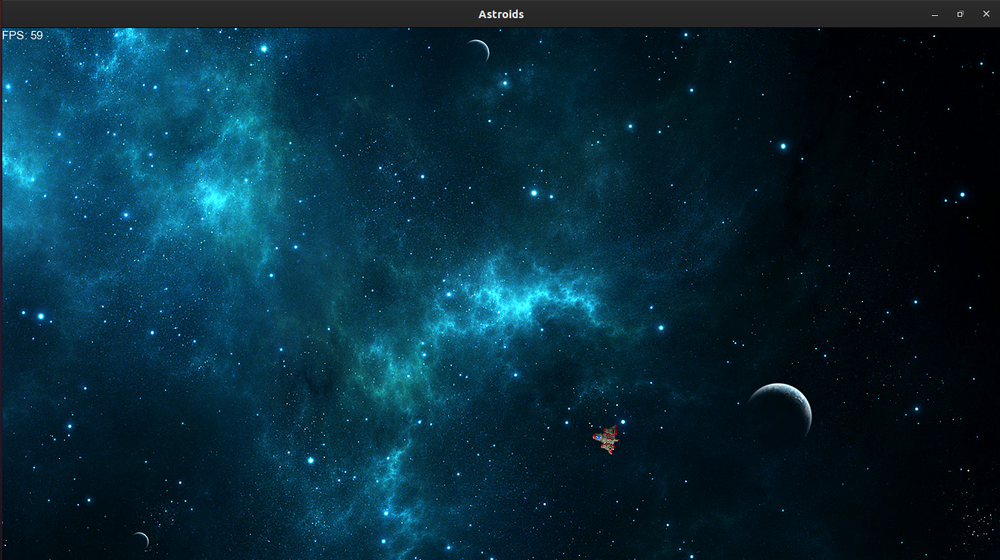

# SFMLEngine

This is a side project that implements different ideas and design principles in order to ultimately create a game 2D engine, and most importantly to empower myself, the developer, with the different techniques and skills in using multiple APIs and different libraries to build the project. The game engine is mainly inspired by Unity 3D. Aiming for a game engine like Unity 3D is like flying too close to the sun, but I believe there are many wonderful things that one can learn from trying to mimic such technology their own way.
Again, this project is created only for learning purposes and for my own passion about getting my hands dirty with pure graphics programming.

---

## What the engine offers?

- The engine at the current state offers a solid entity component system, and maintains good collision detection techniques and optimized rendering.

- The physics system is still under construction as implementing the library used, _box2d_, was not as easy as I expected in the beginning. The implementation of the engine physics will most likely change very soon.

- A very simple way to start a new project and integrate whatever number of scenes you want and a simple way to change between the scenes using a finite state machine in the backend.

---

## Project Layout

There are 4 sub-projects in this project.

- SFMLEngine
  - The engine itself that is compiled later into a static library to be linked in other projects.
- Sandbox
  - A small project used to test out the different features the engine has without the need to recompile the engine.
- MazeGenerator
  - A project created to test the capabilities of the engine and show its ability in creating an actual project.
  - This was another project I created earlier without the engine.
  - I also created it to debug any errors or design inaccuracies I might have had while creating the engine, and it really did payoff.
- Asteroids
  - This project serves the same purpose as the _MazeGenerator_ project, however, it is not fully completed and contains bugs. It requires the update of the physics engine to run collision response code correctly and fix the memory problems that may appear.
  - It is also created before and can be found in this [repositry](https://github.com/Seif-Sallam/Asteroids).

---

## Project Future

The project is intended to support several functionalities.

- Building a robust physics' engine that is easy to use.
- Further make the API easier to use and understand.
- The integration of a responsive UI system using ImGui instead of writing everything as c++ script code.
- Create more test beds for the engine to show the different features of the engine and push it to the limits.
- The integration of 3D?

---

## Compiling the project

The project was maintained and developed on the beginning using Visual Studio, however, the last additions to the engine was made on Linux Ubuntu 20.0 LTS. Trying to use the Visual Studio solution may result be hard, and you may need to work on adding the dependencies by yourself.

There are multiple Make files created for each project. To compile the default project only, run the Makefile in the root folder.

You can run each project alone by going to that project and running _make_ in that project directory.

---

## Screenshots

Sandbox showing the physics working with two different entities.

The blue and the red boxes are TextBoxes and the black box on the top left is a kinematic physics object that can be moved with keyboard.

The maze generator created in the project Maze Generator.

A screenshot from Asteroids project.

## Updates

### February 24th 2022:

- Fixed the segmentation fault when deleting RigidBody2D Component
- Fixed the Pixel per meter Ratio instead of making it 1 : 1, it is now 16 : 1 (found it more reasonable than 32 : 1)
  - All affected components update with correct ratios now, and it now makes Box2D runs faster and more accurate.
- Fixed a small typo in _Maze Generator_ Project, showing the x and y coordinates wrongly.
